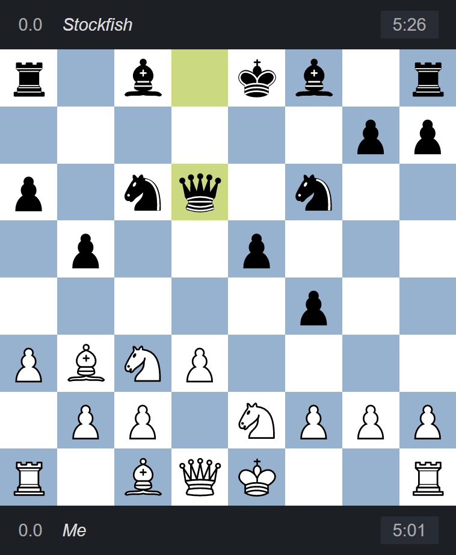

# chess-player

Chess Player is an implementation of [chess game](https://en.wikipedia.org/wiki/Chess) in web browser. It is designed to be played by a human against a built-in AI, or to visualize a game simulation by two AIs.




The app utilizes [Stockfish](https://github.com/official-stockfish/Stockfish) engine as move generator and evaluator.

## Installation

```
git clone https://github.com/findawayer/chess-player.git
cd chess-player
npm install
npm run start
```

## Structure

### Tools

- [TypeScript](https://github.com/microsoft/TypeScript) as Authoring language.
- [React](https://github.com/facebook/react) as Frontend framework.
- [Redux](https://github.com/reduxjs/redux) as React state manager.
- [Redux-Toolkit](https://github.com/reduxjs/redux-toolkit) as Redux authoring template.
- [React-Redux](https://github.com/reduxjs/react-redux) as Redux binder to React.
- [Webpack](https://github.com/webpack/webpack) as Module bundler.
- [Eslint](https://github.com/eslint/eslint) as Code linter.
- [Material-UI](https://github.com/mui-org/material-ui) as Design framework.
- [Chess.js](https://github.com/jhlywa/chess.js) as Chess move validator.
- [Stockfish-js](https://github.com/exoticorn/stockfish-js) as Chess move generator &amp; evaluator.
- [React-Dnd](https://github.com/react-dnd/react-dnd) as Drag-and-drop helper.

### Folders

```
📦chess-player
 ┣ 📂.vscode ── VS Code editor configurations
 ┣ 📂config ── Module bundler configurations
 ┣ 📂docs ── READMEs and related assets
 ┣ 📂public ── Public files
 ┃ ┣ 📂assets
 ┃ ┃ ┣ 📂stockfish ── Chess engine library
 ┃ ┃ ┗ 📂svg ── Chess piece vector graphics
 ┃ ┣ 📂static ── Generated bundle files
 ┣ 📂scripts ── Node scripts
 ┣ 📂src ── Source code
 ┃ ┣ 📂components ── Presentational React components
 ┃ ┣ 📂containers ── React components with Redux data bindings
 ┃ ┣ 📂contexts ── React contexts
 ┃ ┣ 📂helpers ── Utility functions
 ┃ ┣ 📂hooks ── React hooks
 ┃ ┣ 📂pages ── Pages, routes and HTML templates
 ┃ ┣ 📂settings ── App configuration constants
 ┃ ┣ 📂slices ── Redux toolkit slices and state schema
 ┃ ┣ 📂themes ── Material-UI themes
 ┃ ┣ 📂types ── TypeScript type references
 ┃ ┣ 📂vendors ── Library specific resources
 ┃ ┃ ┣ 📂react-dnd ── React-Dnd
 ┃ ┃ ┗ 📂redux ── Redux: store, reducers
 ┃ ┗ 📜index.tsx ── Entry point
```

### Authoring conventions

- Use module aliases for import statements. (e.g. `import Layout from '@components/layout'`)
- Module aliases are declared in `tsconfig.json` and `config/aliases.js`.
- Use function components and hooks over class components whenever possible.
- Store React state into:
  - Local state: Short-term state that changes rapidly, or evaporates after page navigations.
  - Redux store: Mid-term state that persists between page navigations.
  - Localstorage: Reletively long-term state that persists between refreshes.
- Fetch Redux state from a top-level organism components &mdash; or `containers` &mdash;
  and pass it down 1~2 levels into the child components via props. Think about
  introducing a new container beyond that level.
- Callbacks are generally created inside a container and passed down to child components via props,
  however, feel free to `useDispatch` inside the components if it becomes verbose and inefficient.
  React official docs [encourages using dispatch stored inside contexts from a component](https://reactjs.org/docs/hooks-faq.html#how-to-avoid-passing-callbacks-down).
- Use React context API to:
  - make an external instance globally accessible throughout the app,
  - or to provide data only to a limited part of app.
- Create custom hooks to group multiple related states into one unit.
- Use block comment to describe a value, or leave a multiline note. This way, VSCode is able to show the comment in tooltips.
- Use inline comment to describe an action, or leave an inline note.

## Next to come

Features under development or planned for future.

- Visualization of move evaluations.
- CLI for move submissions.

## Browser compatibility

<!-- prettier-ignore-start -->
|  |  | 
--- | --- | --- |
Latest ✅ | Latest ✅ | Latest ✅
<!-- prettier-ignore-end -->

The app makes use of Web Worker API available in modern browsers, check out [the compatibility chart](https://caniuse.com/webworkers).

## Special credits

- [Jeff Hlywa](https://github.com/jhlywa/chess.js) &mdash; Author of game validator `chess.js`.
- [Stockfish](https://github.com/official-stockfish) &mdash; Stockfish chess engine.
- [Colin M.L.Burnett](https://en.wikipedia.org/wiki/User:Cburnett) &mdash; Designer of chess piece graphics.
