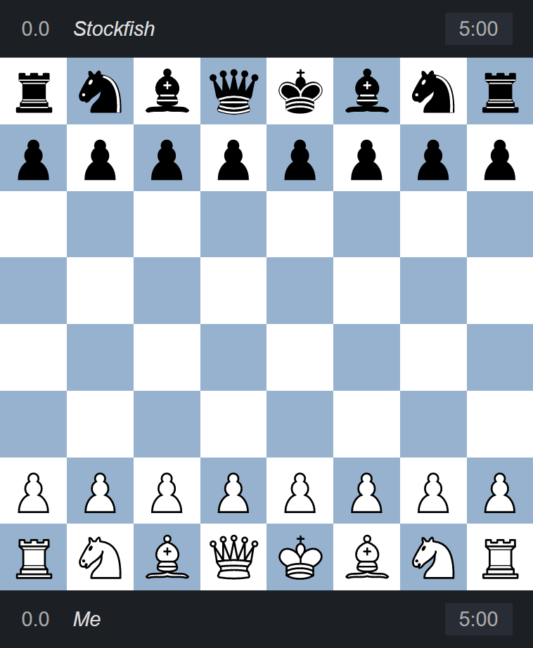
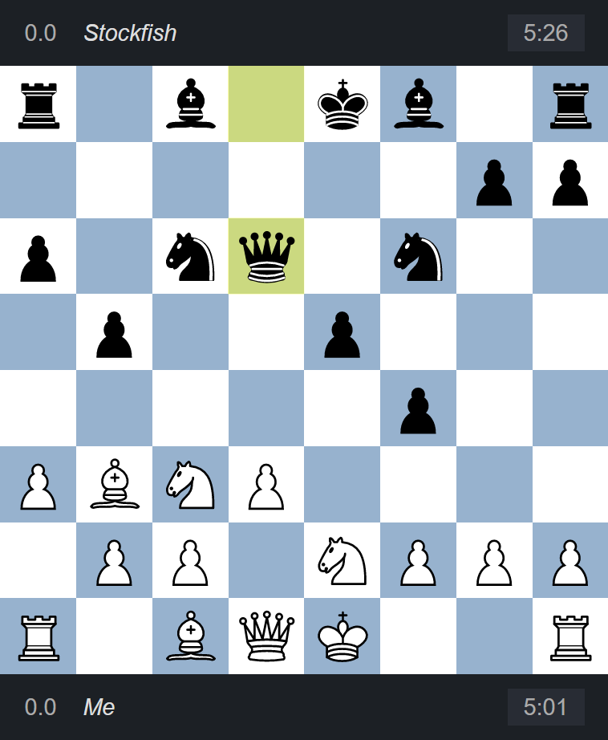

# [chess-player](https://chess-player.vercel.app/) &middot; 

Chess Player is an implementation of [chess game](https://en.wikipedia.org/wiki/Chess) in web browser. It is designed to be played by a human against a built-in AI, or to visualize a game simulation by two AIs.

<table>
  <tbody>
    <tr>
      <td>
        
      </td>
      <td>
        
      </td>
    </tr>
  </tbody>
</table>

The app utilizes [Stockfish](https://github.com/official-stockfish/Stockfish) engine as move generator and evaluator.

## Live demo

Please visit [demo page](https://chess-player.vercel.app/) to visualize chess-player's operation.

## Installation

```
$ git clone https://github.com/findawayer/chess-player.git
$ cd chess-player
$ npm install
$ npm run start
```

## Structure

### Tools

- [TypeScript](https://github.com/microsoft/TypeScript) as Authoring language.
- [Babel](https://github.com/babel/babel) as Code transpiler.
- [React](https://github.com/facebook/react) as Frontend framework.
- [Next.js](https://github.com/vercel/next.js/) as React framework.
- [Redux](https://github.com/reduxjs/redux) as React state manager.
- [Redux-Toolkit](https://github.com/reduxjs/redux-toolkit) as Redux authoring template.
- [React-Redux](https://github.com/reduxjs/react-redux) as Redux binder to React.
- [Eslint](https://github.com/eslint/eslint) as Code linter.
- [Material-UI](https://github.com/mui-org/material-ui) as Design framework.
- [Chess.js](https://github.com/jhlywa/chess.js) as Chess move validator.
- [Stockfish-js](https://github.com/exoticorn/stockfish-js) as Chess move generator &amp; evaluator.
- [React-Dnd](https://github.com/react-dnd/react-dnd) as Drag-and-drop helper.

### Folders

```
📦chess-player
 ┣ 📂.vscode ── VS Code editor configurations
 ┣ 📂docs ── READMEs and related assets
 ┣ 📂public ── Static files
 ┃ ┣ 📂stockfish ── Chess engine library
 ┃ ┗ 📂svg ── Chess piece vector graphics
 ┣ 📂scripts ── Node scripts
 ┣ 📂src ── Source code
 ┃ ┣ 📂components ── Presentational React components
 ┃ ┣ 📂containers ── React components with Redux data bindings
 ┃ ┣ 📂contexts ── React contexts
 ┃ ┣ 📂helpers ── Utility functions
 ┃ ┣ 📂hooks ── React hooks
 ┃ ┣ 📂pages ── Next.js pages
 ┃ ┗ 📜_app.tsx ── Client side markup
 ┃ ┗ 📜_document.tsx ── Server side markup
 ┃ ┣ 📂settings ── App configuration constants
 ┃ ┣ 📂slices ── Redux toolkit slices and state schema
 ┃ ┣ 📂types ── TypeScript type references
 ┃ ┗ 📂vendors ── Library specific resources
 ┃ ┃ ┣ 📂material-ui ── Material UI themes
 ┃ ┃ ┣ 📂react-dnd ── React-Dnd setup
 ┃ ┃ ┗ 📂redux ── Redux store & reducers
```

## Next to come

Features under development or planned for future.

- Visualization of move evaluations.
- CLI for move submissions.

## Browser compatibility

<!-- prettier-ignore-start -->
|  |  | 
--- | --- | --- |
Latest ✅ | Latest ✅ | Latest ✅
<!-- prettier-ignore-end -->

The app makes use of Web Worker API available in modern browsers, check out [the compatibility chart](https://caniuse.com/webworkers).

## Special credits

- [Jeff Hlywa](https://github.com/jhlywa/chess.js) &mdash; Author of game validator `chess.js`.
- [Stockfish](https://github.com/official-stockfish) &mdash; Stockfish chess engine developer team.
- [Colin M.L.Burnett](https://en.wikipedia.org/wiki/User:Cburnett) &mdash; Designer of chess piece graphics.
